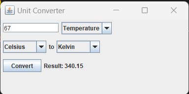

# Unit Converter Tool Using Swing

Unit Converter is a Java-based application using Swing GUI Toolkit that allows users to convert various quantities like Temperature, Weight, Height, and Density from one unit to another. This program provides a user-friendly interface for performing conversions quickly.

## Features

- **Multiple Conversion Options:** Convert between different units of quantities, including Temperature, Weight, Height, Density, Speed etc.

- **User-Friendly Interface:** The program offers a simple and intuitive GUI for entering values and selecting conversion units.

- **Error Handling:** It includes error handling for invalid inputs, ensuring a smooth user experience.

## Getting Started

To get started with the Unit Converter, follow these steps:

1. Clone the repository to your local machine: 
https://github.com/fareedahb/ConverterProject.git
   
3. Open the project in your preferred Java development environment (e.g., Eclipse, IntelliJ IDEA).

4. Build and run the application.

## Usage

1. Launch the Unit Converter application.

2. Enter the value you want to convert in the input field.

3. Select the quantity  of the value you want to convert in the dropdown. 

4. Select the unit you want to convert from in the "From" dropdown.

5. Select the unit you want to convert to in the "To" dropdown.

6. Click the "Convert" button.

7. The converted value will be displayed in the result area.

8. You can repeat the process for different conversions.

## Screenshots

